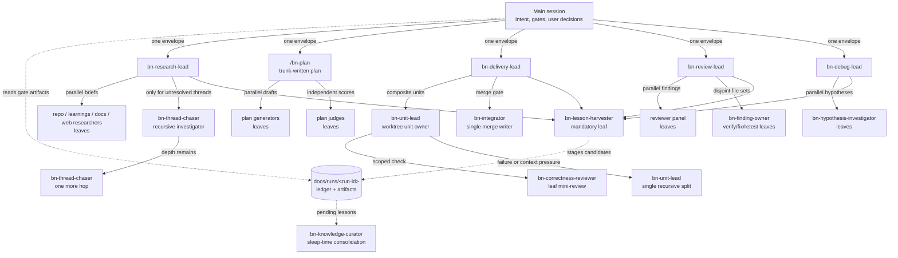

# Banyan

**A hierarchical, self-compounding agent harness for Claude Code, built for nested subagents.**

A banyan tree's branches drop aerial roots that become new trunks — a single tree that grows into a forest. It begins life on a host tree before standing on its own, and it lives for centuries, continuously expanding. That's the project: agents whose branches become trunks (nested subagents, Claude Code ≥ 2.1.172), bootstrapped from the leaf assets of [compound-engineering-plugin](https://github.com/EveryInc/compound-engineering-plugin) (MIT), designed for harnesses that outlive any single task and get better with every run.

## Core ideas

- **Subtrees with contracts, not waves.** Lead agents (`bn-review-lead`, `bn-research-lead`, `bn-delivery-lead`) own whole domains and orchestrate their own children; the main session stays a near-empty trunk that talks to the user.
- **Fractal compounding.** Lessons are harvested at the leaves, where context is fresh, and consolidated by a background curator — compounding as metabolism, not a command you remember to run.
- **The ledger is the ground truth.** Coordination happens through files (`docs/runs/<run-id>/`); final messages are verdicts plus paths.
- **Delegation envelopes.** Every spawn carries an objective, an artifact path, boundaries, and a budget (children, model tier, remaining depth).
- **The laws still hold.** Reads parallelize, writes serialize, one writer per file set, decompose on failure rather than eagerly.

## Current nesting shape

Most workers are leaves. The current nesting advantage is that lead agents own
their internal orchestration, while the trunk holds intent, gates, and user-facing
decisions.



## Requirements

- [Claude Code](https://claude.com/claude-code) ≥ 2.1.172 (nested subagents).
- For the development scripts (`scripts/*.ps1`): [PowerShell 7+](https://github.com/PowerShell/PowerShell) (`pwsh` — runs on macOS via `brew install --cask powershell`, Linux, and Windows) and Node.js (the test fixture and the run-ledger scaffolder are zero-dependency Node). The plugin itself needs neither at runtime beyond Node for the run-ledger scaffolder.

## Install

From a checkout of this repository:

```
claude plugin marketplace add <path-to-this-repo>
claude plugin install banyan
```

Restart or reload the `claude` session, then verify with `/bn-hello` — it prints the installed Banyan version. For the full capability check (environment floor, asset integrity, and a live depth-2 nested-spawn probe), run `/bn-doctor`.

For development against the seeded-bug test fixture instead:

```
pwsh scripts/smoke.ps1   # builds the fixture sandbox, installs the plugin, runs /bn-hello headlessly
```

## Quickstart

In a `claude` session inside the repo you want to work on:

```
/bn-grow <feature or task description>
```

`/bn-grow` runs the full pipeline — research → plan (judged) → deliver → review → ship gate → background curate — coordinating through a run ledger at `docs/runs/<run-id>/` that you can watch live. The pipeline never pushes; shipping is an explicit step you take at the end.

Each stage is also independently invocable:

| Skill | What it does |
| --- | --- |
| `/bn-brainstorm` | Collaborative requirements dialogue producing a requirements doc that hands off to `/bn-plan` — the front of the loop for fuzzy ideas. |
| `/bn-onboard` | Onboard an existing repo by classifying the documentation corpus, gating linked derivatives, bootstrapping curator knowledge, drafting instructions, and emitting a manifest. |
| `/bn-review` | The flagship review subtree: reviews a diff, dedupes findings, and fixes-and-verifies them in place, returning an applied verdict (commits on a clean tree, never pushes). |
| `/bn-plan` | A plan from a judge panel: prior-biased generators (mvp / risk / ops) scored by independent judges, synthesized by the trunk. |
| `/bn-work` | Execute a plan via worktree-isolated unit subtrees plus a single integrator. |
| `/bn-debug` | The debug subtree: reproduce, rank hypotheses, test them with parallel fresh-context investigators, confirm the causal chain, then fix test-first on your say-so. |
| `/bn-commit` | A well-crafted commit from the working tree (repo conventions, logical grouping, named-file staging). Never pushes. |
| `/bn-ship` | Commit → push → PR with an adaptive, value-first description — the one place in Banyan allowed to push. |
| `/bn-resolve-pr` | Resolve PR review feedback: parallel resolvers fix locally; the trunk validates, commits, pushes, replies, and resolves threads. |
| `/bn-curate` | Consolidate harvested lessons into `docs/solutions/` (sleep-time compute; runs in the background after `/bn-grow`). |
| `/bn-tune` | Mine accumulated run data for recurring harness failures and propose evidence-cited diffs to Banyan itself — proposals only, a human applies them. |
| `/bn-conventions` | Index of the ledger, envelope, and knowledge-store conventions. |
| `/bn-doctor` | Capability check: environment floor, asset integrity, and a live depth-2 nested-spawn + allowlist-enforcement probe. |
| `/bn-hello` | Install check: confirms the plugin loaded and prints its version. |

The plugin ships 38 agents: the four lead subtrees (review, research, delivery, debug) plus `bn-unit-lead`/`bn-integrator`, 18 reviewer/researcher personas vendored from compound-engineering, the `bn-finding-owner`/`bn-thread-chaser`/`bn-plan-generator`/`bn-plan-judge`/`bn-pr-comment-resolver`/`bn-hypothesis-investigator` workers, `bn-custom-reviewer` (host-repo review personas via data, not roster edits), the `bn-lesson-harvester` + `bn-knowledge-curator` compounding loop, the `bn-harness-engineer`, the `bn-doc-surveyor`/`bn-doc-transformer` onboarding pair, and the `bn-probe`/`bn-probe-leaf` doctor pair. See [`plugin/README.md`](plugin/README.md) for the roster and [`plugin/AGENTS.md`](plugin/AGENTS.md) for the conventions contract (the eight invariants, the lead pattern, allowlist-as-org-chart).

## Workflows

### Onboard an existing repo

```
/bn-onboard
```

For repos that need a Banyan-ready knowledge base before task work. The trunk inventories
the documentation corpus, runs a classification gate, writes linked derivative artifacts,
bootstraps curator-ready knowledge, drafts repo instructions, and emits an onboarding
manifest with the artifact graph and handoff paths.

### Ship a feature end to end

```
/bn-grow add per-tenant rate limiting to the public API
```

The trunk clarifies intent with you, opens a run ledger, then dispatches the subtrees in
sequence — research → plan (judged) → deliver → review — with an explicit artifact gate
between each stage, so a failed stage stops the pipeline instead of being papered over.
Watch the run live:

```
tail -f docs/runs/<run-id>/ledger.md
```

The pipeline ends at a **ship gate**: the work is committed locally, reviewed, and green,
but pushing or opening a PR is a step you take yourself — `/bn-ship` when you're ready.
Lesson curation runs in the background afterward. A run halted mid-pipeline resumes from
its ledger once the blocker is cleared.

### Brainstorm first

```
/bn-brainstorm what if rate limits were configurable per customer tier?
```

For ideas that aren't yet feature descriptions. A collaborative dialogue — one question
per turn, scope-tiered rigor probes, 2-3 concrete approaches with a recommendation —
ending in a requirements document under `docs/brainstorms/` strong enough that planning
doesn't have to invent product behavior. The handoff menu flows straight into `/bn-plan`
(or `/bn-work` for lightweight, well-defined changes); for grounding questions a short
scan can't answer, it can dispatch the research subtree and fold the brief in.

### Review a change

```
/bn-review                     # the current branch against the default base
/bn-review base:origin/main    # an explicit base ref
/bn-review 1234                # a PR by number or URL (remote scope: report-only)
```

Unlike a report-style reviewer, `/bn-review` resolves what it finds: each confirmed
finding gets an owner that independently verifies, fixes, and re-tests it, and the lead
returns an **applied verdict** — fixes committed on a clean tree, never pushed. Run it
before opening a PR or as a final pass over `/bn-work` output. Effort scales with the
diff: a trivial change gets an inline check; a large or sensitive one (auth, payments,
migrations) gets the full panel plus the adversarial reviewer. Host repos can extend the
panel with their own reviewer personas — files under `docs/review-personas/`, no plugin
edits (see [`docs/review-personas/`](docs/review-personas/)).

### Debug a failure

```
/bn-debug the orders test fails: stock drifts negative after a failed checkout
/bn-debug 1234        # a GitHub issue
```

Distributed debugging with the discipline single-context debugging loses under
pressure: the subtree reproduces first, ranks falsifiable hypotheses, and tests them in
**parallel fresh-context investigators** that write their predictions down *before*
running anything — so a refuted hypothesis is evidence, not wasted work. Nothing is
fixed until every link of the causal chain carries tested evidence; then you choose
**Fix now** (regression test first, minimal fix, suite green, committed but never
pushed), **Diagnosis only**, or **Rethink design** (hands off to `/bn-brainstorm`). A
confirmed fix stages a bug-track solution doc, so the knowledge store compounds from
every debugging session.

### Ship it

```
/bn-commit            # a well-crafted local commit (never pushes)
/bn-ship              # commit -> push -> PR, with a value-first description
/bn-ship 1234         # rewrite an existing PR's description
```

`/bn-ship` is **the one place in Banyan allowed to push or open a PR** — trunk-level,
foreground, with you present; every subtree stops at the permission cliff and reports
instead. It handles branch safety (stale base, unpushed commits, dirty trees), builds
commits per `/bn-commit`'s doctrine, and writes PR descriptions that explain what the
diff cannot show. Use it after `/bn-grow`'s ship gate, after a standalone `/bn-review`,
or any time the work is ready to leave your machine.

### Resolve PR feedback

```
/bn-resolve-pr                # all unresolved threads on the current branch's PR
/bn-resolve-pr 1234           # a PR by number
/bn-resolve-pr <thread-url>   # exactly one thread
```

Works the review feedback like a colleague would: triage (bot boilerplate silently
dropped), parallel resolver agents fixing valid findings on disjoint file sets, one
combined validation run, one commit, one push — then replies with quoted context and
resolves the threads. Feedback that doesn't hold gets a `not addressing` reply with
evidence; harmful suggestions get `declined` with the harm named; judgment calls come
back to you with options and a lean. Stops after two fix-verify cycles and surfaces the
pattern instead of churning.

### Plan first, execute when you're ready

```
/bn-plan migrate the session store from memory to redis
# read (and edit) the plan doc it writes under docs/plans/ ...
/bn-work
```

Use this split instead of `/bn-grow` when you want a human gate between planning and
execution. `/bn-plan` drafts competing approaches under different priors (mvp-first /
risk-first / ops-first), scores them with an independent judge panel, and synthesizes the
winner into a plan doc with stable unit IDs; pass it a research-brief path instead of a
description to ground it in prior research. `/bn-work` executes the latest plan (or a
path you give it): atomic units inline, composite units in isolated worktrees with their
own test-fix loop and mini-review, and a single integrator merging in dependency order.

### Keep the harness compounding

```
/bn-curate    # consolidate staged lessons into docs/solutions/
/bn-tune      # once ~5 runs have accumulated: propose improvements to Banyan itself
```

Every lead stages candidate lessons before it returns; curation promotes the keepers into
the `docs/solutions/` knowledge store, where future runs retrieve them. `/bn-grow`
dispatches curation automatically — run `/bn-curate` manually after standalone
`/bn-review`, `/bn-work`, `/bn-debug`, or `/bn-resolve-pr` runs. `/bn-tune` mines accumulated run ledgers and transcripts
for recurring harness failures and writes evidence-cited proposals to
`docs/harness-proposals/`; it never edits the plugin itself — you review and apply.

## Evaluation

The review subtree is benchmarked A/B against compound-engineering's `/ce-code-review` on a reproducible seeded-bug fixture (12 seeded bugs, published ground truth), replicated over an advertised and a fair de-advertised run: detection parity, with Banyan delivering applied-and-verified fixes (suite green, safe commit) from a ~7–8× smaller trunk footprint at comparable cost. The harness, protocol, and filled scorecard live in [`eval/review-ab/`](eval/review-ab/); the evaluation is rerunnable with `pwsh eval/review-ab/run-ab.ps1`.

## Repository layout

```
plugin/        the Claude Code plugin (38 agents, 15 skills, schemas, AGENTS.md contract)
docs/          founding brainstorm, decision records, plans, harness changelog & proposals
eval/          the /bn-review vs /ce-code-review A/B evaluation harness and results
scripts/       dev loop: fixture init, dev install, smoke test, vendoring, validation
test/          seeded-bug fixture repo and a planted two-hop research scenario
vendor/        provenance for assets vendored from compound-engineering (pinned SHA)
```

## Documents

- [Founding brainstorm](docs/brainstorms/2026-06-10-banyan-v2-brainstorm.md) — the research synthesis and full v2 ideation (verbatim export).
- [Fork vs greenfield decision](docs/decisions/2026-06-10-fork-vs-greenfield.md) — why Banyan is a new plugin that vendors compound-engineering's leaf agents rather than a fork.
- [Implementation plan](docs/plans/2026-06-10-001-feat-banyan-core-plan.md) — the phased plan the codebase is built to.

## License

MIT — see [LICENSE](LICENSE). Banyan vendors leaf assets from EveryInc's [compound-engineering-plugin](https://github.com/EveryInc/compound-engineering-plugin) (MIT); attribution in [NOTICE](NOTICE) and per-file provenance in [`vendor/MANIFEST.md`](vendor/MANIFEST.md).
