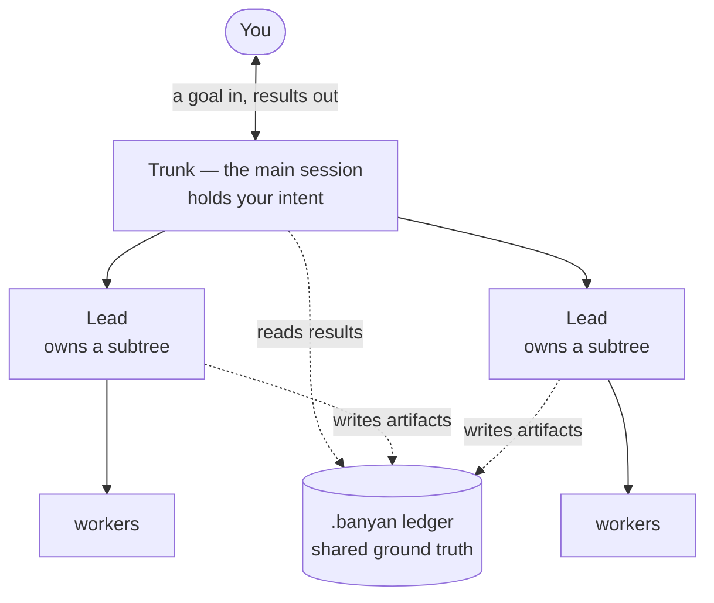
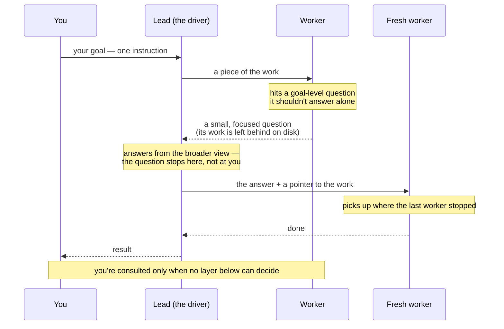

# Banyan

**A hierarchical, self-compounding agent harness for Claude Code, built for nested subagents.**

A banyan tree's branches drop aerial roots that become new trunks — a single tree that grows into a forest. It begins life on a host tree before standing on its own, and it lives for centuries, continuously expanding. That's the project: agents whose branches become trunks (nested subagents, Claude Code ≥ 2.1.172), bootstrapped from the leaf assets of [compound-engineering-plugin](https://github.com/EveryInc/compound-engineering-plugin) (MIT), designed for harnesses that outlive any single task and get better with every run.

## Core ideas

- **Subtrees with contracts, not waves.** Lead agents (`bn-review-lead`, `bn-research-lead`, `bn-delivery-lead`) own whole domains and orchestrate their own children; the main session stays a near-empty trunk that talks to the user.
- **Leads answer; they don't just relay.** When a child hits a goal/intent question it can't resolve, it returns a bounded *ask* and leaves its full transcript on disk. The lead re-states the goal, answers from the ask alone — never reading the transcript — and a fresh continuation peer rehydrates from that transcript and proceeds. Questions resolve at the lowest competent layer; the human is the last rung, not the first.
- **Fractal compounding.** Lessons are harvested at the leaves, where context is fresh, and consolidated by a background curator — compounding as metabolism, not a command you remember to run.
- **The ledger is the ground truth.** Coordination happens through files (`.banyan/runs/<run-id>/`); final messages are verdicts plus paths.
- **Delegation envelopes.** Every spawn carries an objective, an artifact path, boundaries, and a budget (children, model tier, remaining depth).
- **The laws still hold.** Reads parallelize, writes serialize, one writer per file set, decompose on failure rather than eagerly.

## How orchestration works

You talk to **one** thing — the trunk. You hand it a goal (`/bn-grow ...`) and read
the result; everything else happens below the waterline. **The shape** is who owns
what underneath: each lead owns a subtree and runs its own workers, and they
coordinate through files instead of one crowded shared context.



So why does that beat one agent doing everything? **The loop.** A lead acts less like
a relay and more like a *human driving the tool*: when a worker hits a question it
shouldn't answer alone, it hands the lead a small, focused question and leaves its
work behind; the lead answers from its broader view, and a fresh worker picks up where
the last one stopped. Questions resolve at the lowest layer that actually can — so
**you sit at the top of that ladder and are reached only as a last resort.**



The lead answers from the *question*, never by reading the worker's full context — so
a lead's own context stays small no matter how much work happens beneath it. That, plus
keeping you off the critical path, is what lets the tree go deep without overwhelming
anyone — you or the model.

## Requirements

- [Claude Code](https://claude.com/claude-code) ≥ 2.1.172 (nested subagents).
- For the development scripts (`scripts/*.ps1`): [PowerShell 7+](https://github.com/PowerShell/PowerShell) (`pwsh` — runs on macOS via `brew install --cask powershell`, Linux, and Windows) and Node.js (the test fixture and the run-ledger scaffolder are zero-dependency Node). The plugin itself needs neither at runtime beyond Node for the run-ledger scaffolder.

## Install

From a checkout of this repository:

```
claude plugin marketplace add <path-to-this-repo>
claude plugin install banyan
```

Restart or reload the `claude` session, then verify with `/bn-hello` — it prints the installed Banyan version. For the full capability check (environment floor, asset integrity, and a live depth-2 nested-spawn probe), run `/bn-doctor`.

For development against the seeded-bug test fixture instead:

```
pwsh scripts/smoke.ps1   # builds the fixture sandbox, installs the plugin, runs /bn-hello headlessly
```

## Quickstart

In a `claude` session inside the repo you want to work on:

```
/bn-grow <idea or feature/task description>
```

`/bn-grow` runs the full pipeline — optional brainstorm intake for fuzzy ideas → research → spec stress when warranted → plan (judged) → deliver (which runs the full reviewer panel and a bounded review→fix loop on its own integrated result) → ship gate → curation handoff — coordinating through a run ledger at `.banyan/runs/<run-id>/` that you can watch live. The pipeline never pushes; shipping is an explicit step you take at the end.

Each stage is also independently invocable:

| Skill | What it does |
| --- | --- |
| `/bn-brainstorm` | Collaborative requirements dialogue producing a requirements doc that hands off to `/bn-spec-stress` or `/bn-plan` — the front of the loop for fuzzy ideas. |
| `/bn-spec-stress` | Stress-test a requirements doc before planning: missing scenarios, hidden assumptions, acceptance gaps, and plan-affecting risks become a gate brief. |
| `/bn-ask` | Grounded codebase Q&A: answers repo questions, checks hypotheses, explains limitations, and escalates to the research subtree only when needed. |
| `/bn-onboard` | Onboard an existing repo by classifying the documentation corpus, gating linked derivatives, bootstrapping curator knowledge, drafting instructions, and emitting a manifest. |
| `/bn-review` | The flagship review subtree, **read-only**: reviews a diff, dedupes findings, and returns a findings report (it edits and commits nothing). To fix findings, address them yourself or run `/bn-work` — whose delivery lead runs this same panel and a bounded review→fix loop on its own work. |
| `/bn-plan` | A plan from a requirements doc, research brief, spec-stress brief, or task: `bn-plan-lead` owns the generator/judge/checker panel and writes the durable plan. |
| `/bn-work` | Execute a durable plan or lightweight direct-work spec via worktree-isolated unit subtrees plus a single integrator, then run the full reviewer panel on the integrated result and fix its findings in a bounded review→fix→re-review loop (2 rounds; `--no-review` to skip). Commits per unit and per review round; never pushes. |
| `/bn-debug` | The debug subtree: reproduce, rank hypotheses, test them with parallel fresh-context investigators, confirm the causal chain, then fix test-first on your say-so. |
| `/bn-ship` | Commit → push → PR with an adaptive, value-first description — the one place in Banyan allowed to push. |
| `/bn-resolve-pr` | Resolve PR review feedback: parallel resolvers fix locally; the trunk validates, commits, pushes, replies, and resolves threads. |
| `/bn-curate` | Consolidate harvested lessons into `.banyan/solutions/` (sleep-time compute; receives the `/bn-grow` curation handoff). |
| `/bn-tune` | Mine accumulated run data for recurring harness failures and propose evidence-cited diffs to Banyan itself — proposals only, a human applies them. |
| `/bn-conventions` | Index of the ledger, envelope, and knowledge-store conventions. |
| `/bn-doctor` | Capability check: environment floor, asset integrity, and live depth-2 nested-spawn, allowlist, and nested user-question probes. |
| `/bn-hello` | Install check: confirms the plugin loaded and prints its version. |

The plugin ships 47 agents: the five lead subtrees (review, research, delivery, debug, plan) plus `bn-unit-lead`/`bn-integrator`, 19 reviewer/researcher personas vendored from compound-engineering (including `bn-deployment-verifier`), the native `bn-yagni-reviewer` and `bn-dogfood-verifier`, the `bn-finding-owner`/`bn-thread-chaser`/`bn-plan-generator`/`bn-plan-judge`/`bn-plan-checker`/`bn-pr-comment-resolver`/`bn-hypothesis-investigator` workers, the `bn-mock-builder` mock leaf, the `bn-spec-scenario-reviewer`/`bn-spec-assumption-reviewer`/`bn-spec-threat-reviewer` stress lenses, the `bn-lesson-harvester` + `bn-knowledge-curator` compounding loop, the `bn-consult-extractor` disposable single-fact transcript reader for the consult loop, the `bn-harness-engineer`, the `bn-doc-surveyor`/`bn-doc-transformer` onboarding pair, and the `bn-probe`/`bn-probe-leaf` doctor pair. See [`plugin/README.md`](plugin/README.md) for the roster and [`plugin/AGENTS.md`](plugin/AGENTS.md) for the conventions contract (the eight invariants, the lead pattern, allowlist-as-org-chart).

## Workflows

### Onboard an existing repo

```
/bn-onboard
```

For repos that need a Banyan-ready knowledge base before task work. The trunk inventories
the documentation corpus, runs a classification gate, writes linked derivative artifacts,
bootstraps curator-ready knowledge, drafts repo instructions, and emits an onboarding
manifest with the artifact graph and handoff paths.

### Ship a feature end to end

```
/bn-grow add per-tenant rate limiting to the public API
```

The trunk classifies the input, opens a run ledger, runs brainstorm intake when the idea is
still fuzzy, then dispatches the subtrees in sequence — research → spec stress when
warranted → plan (judged) → deliver (which now runs the full-panel review + bounded fix loop
on its own work) — with an explicit artifact gate between each stage.
Failed gates trigger bounded recovery by the owning phase before anything is surfaced.
Watch the run live:

```
tail -f .banyan/runs/<run-id>/ledger.md
```

The pipeline ends at a **ship gate**: the work is committed locally, reviewed, and green,
but pushing or opening a PR is a step you take yourself — `/bn-ship` when you're ready.
Lesson curation is handed off afterward without blocking the ship gate. A run halted
mid-pipeline writes `.banyan/runs/<run-id>/residuals.md` and resumes from its ledger once the
blocker is cleared.

### Brainstorm first

```
/bn-brainstorm what if rate limits were configurable per customer tier?
```

For standalone ideas that aren't yet feature descriptions. A collaborative dialogue — one
question per turn, scope-tiered rigor probes, 2-3 concrete approaches with a recommendation
— ending in a requirements document under `.banyan/brainstorms/` strong enough that planning
doesn't have to invent product behavior. The handoff menu flows into `/bn-spec-stress`,
`/bn-plan`, or `/bn-work` direct mode for lightweight, well-defined changes; for grounding questions
a short scan can't answer, it can dispatch the research subtree and fold the brief in.
`/bn-grow` uses the same requirements-intake contract automatically when its input is fuzzy.

### Stress requirements before planning

```
/bn-spec-stress .banyan/brainstorms/2026-06-12-example-requirements.md
```

Use this after a requirements doc exists and before `/bn-plan` when the scope is standard or
deep, the brainstorm surfaced assumptions, or the feature touches multi-step behavior, roles,
data, permissions, external tools, or abuse surfaces. The output lands at
`.banyan/runs/<run-id>/briefs/spec-stress.md`: unresolved `Resolve Before Planning` items
require disposition before planning; `/bn-grow` attempts that disposition automatically,
while standalone use surfaces the blocker. `Plan Inputs` and `Accepted Risks` feed `/bn-plan`.

### Ask about a codebase

```
/bn-ask how does the review lead choose conditional reviewers?
/bn-ask is lesson harvesting mandatory before every lead returns?
```

Use `/bn-ask` for read-only orientation, codebase questions, and hypothesis checks. It
answers with source evidence, confidence, and explicit unknowns; broad questions use the
research subtree and return a distilled answer rather than raw research.

### Review a change

```
/bn-review                     # the current branch against the default base
/bn-review base:origin/main    # an explicit base ref
/bn-review 1234                # a PR by number or URL (remote scope)
```

`/bn-review` is **read-only**: it reviews and reports, it does not fix. The lead runs the
warranted reviewer panel, dedupes the findings, and returns a **findings report** — an
advisory verdict plus an actionable to-do list (`findings/merged.json`); it edits nothing
and commits nothing. Run it before opening a PR, to audit someone else's branch or PR, or as
a standalone read of `/bn-work` output. To *act* on the findings, address them yourself or
run `/bn-work`, whose delivery lead runs this same panel on its own integrated work and
drives a bounded review→fix→re-review loop (2 rounds) with `bn-finding-owner`s. Effort scales
with the diff: a trivial change gets an inline check; a large or sensitive one (auth,
payments, migrations) gets the full warranted panel plus the adversarial reviewer.
Repo-specific review rules belong in `AGENTS.md`, `CLAUDE.md`, or directory-scoped
instruction files; `bn-project-standards-reviewer` audits those written rules during the
panel run.

### Debug a failure

```
/bn-debug the orders test fails: stock drifts negative after a failed checkout
/bn-debug 1234        # a GitHub issue
```

Distributed debugging with the discipline single-context debugging loses under
pressure: the subtree reproduces first, ranks falsifiable hypotheses, and tests them in
**parallel fresh-context investigators** that write their predictions down *before*
running anything — so a refuted hypothesis is evidence, not wasted work. Nothing is
fixed until every link of the causal chain carries tested evidence; then you choose
**Fix now** (regression test first, minimal fix, suite green, committed but never
pushed), **Diagnosis only**, or **Rethink design** (hands off to `/bn-brainstorm`). A
confirmed fix stages a bug-track solution doc, so the knowledge store compounds from
every debugging session.

### Ship it

```
/bn-ship              # commit -> push -> PR, with a value-first description
/bn-ship 1234         # rewrite an existing PR's description
```

`/bn-ship` is **the one place in Banyan allowed to push or open a PR** — trunk-level,
foreground, with you present; every subtree stops at the permission cliff and reports
instead. It handles branch safety (stale base, unpushed commits, dirty trees), builds
well-crafted commits (repo conventions, logical grouping, named-file staging), and writes
PR descriptions that explain what the diff cannot show. Use it after `/bn-grow`'s ship gate, after a standalone `/bn-review`,
or any time the work is ready to leave your machine.

### Resolve PR feedback

```
/bn-resolve-pr                # all unresolved threads on the current branch's PR
/bn-resolve-pr 1234           # a PR by number
/bn-resolve-pr <thread-url>   # exactly one thread
```

Works the review feedback like a colleague would: triage (bot boilerplate silently
dropped), parallel resolver agents fixing valid findings on disjoint file sets, one
combined validation run, one commit, one push — then replies with quoted context and
resolves the threads. Feedback that doesn't hold gets a `not addressing` reply with
evidence; harmful suggestions get `declined` with the harm named; judgment calls come
back to you with options and a lean. Stops after two fix-verify cycles and surfaces the
pattern instead of churning.

### Plan first, execute when you're ready

```
/bn-plan migrate the session store from memory to redis
# read (and edit) the plan doc it writes under .banyan/plans/ ...
/bn-work
```

Use this split instead of `/bn-grow` when you want a human gate between planning and
execution. `/bn-plan` drafts competing approaches under different priors (mvp-first /
risk-first / ops-first), scores them with an independent judge panel, and synthesizes the
winner into a plan doc with stable unit IDs; pass it a requirements-doc path,
research-brief path, or spec-stress brief path instead of a description to ground it in prior work. Blank `/bn-work`
executes the latest durable plan, and `/bn-work .banyan/plans/...-plan.md` executes that plan
explicitly.

For lightweight work where the executable plan already exists in the conversation, pass a
direct instruction:

```
/bn-work use the plan above
```

Direct mode gates for clear scope, file boundaries, simple dependencies, obvious
verification, and low risk. When it passes, `/bn-work` writes
`.banyan/runs/<run-id>/briefs/direct-work-plan.md` itself and then runs the same delivery
subtree: atomic units inline, composite units in isolated worktrees with their own
test-fix loop and mini-review, and a single integrator merging in dependency order.

### Keep the harness compounding

```
/bn-curate    # consolidate staged lessons into .banyan/solutions/
/bn-tune      # once ~5 runs have accumulated: propose improvements to Banyan itself
```

Every lead stages candidate lessons before it returns; curation promotes the keepers into
the `.banyan/solutions/` knowledge store, where future runs retrieve them. `/bn-grow` ends
with a non-blocking curation handoff: it starts `/bn-curate <run-id>` only when a real
background mechanism is available, otherwise it gives you that follow-up command. Run
`/bn-curate` manually after standalone `/bn-review`, `/bn-work`, `/bn-debug`, or
`/bn-resolve-pr` runs. `/bn-tune` mines accumulated run ledgers and transcripts for
recurring harness failures and writes evidence-cited proposals to `.banyan/harness-proposals/`;
it never edits the plugin itself — you review and apply.

## Evaluation

The review subtree is benchmarked A/B against compound-engineering's `/ce-code-review` on a reproducible seeded-bug fixture (12 seeded bugs, published ground truth), replicated over an advertised and a fair de-advertised run: detection parity, with Banyan delivering applied-and-verified fixes (suite green, safe commit) from a ~7–8× smaller trunk footprint at comparable cost. The harness, protocol, and filled scorecard live in [`eval/review-ab/`](eval/review-ab/); the evaluation is rerunnable with `pwsh eval/review-ab/run-ab.ps1`. **Note:** that benchmark predates making `/bn-review` read-only — fix-application has since moved into `/bn-work`'s delivery lead (the bounded review→fix loop), so the "applied-and-verified" arm now corresponds to `/bn-work`, and the A/B is pending a re-baseline.

## Repository layout

```
plugin/        the Claude Code plugin (47 agents, 17 skills, schemas, hooks, AGENTS.md contract)
docs/          founding brainstorms, decision records, harness changelog
eval/          the /bn-review vs /ce-code-review A/B evaluation harness and results
scripts/       dev loop: fixture init, dev install, smoke test, vendoring, validation
test/          seeded-bug fixture repo and a planted two-hop research scenario
vendor/        provenance for assets vendored from compound-engineering (pinned SHA)
```

Only `plugin/` ships when the plugin is installed; every other directory is authoring
and development context. The split, and the rules for keeping the two apart, are in
[`AGENTS.md`](AGENTS.md).

## `.banyan/` layout

`.banyan/` is ignored local state for a host repo using Banyan. It may contain:

| Path | Purpose |
| --- | --- |
| `.banyan/runs/<run-id>/` | Per-run coordination ledger and phase artifacts. Common files include `ledger.md`, `residuals.md`, `delivery-report.md`, `review-verdict.md`, `curation-summary.md`, and subdirectories such as `briefs/`, `progress/`, `findings/`, and `lessons-staging/`. |
| `.banyan/solutions/` | Curated knowledge store used by future runs. Entries live in category subdirectories and use the solution frontmatter schema. |
| `.banyan/brainstorms/` | Requirements and intake documents produced by `/bn-brainstorm` or the fuzzy-intake stage of `/bn-grow`. |
| `.banyan/plans/` | Durable implementation plans produced by `/bn-plan` or `/bn-grow`, named with stable unit IDs for `/bn-work`. |
| `.banyan/harness-proposals/` | Evidence-cited `/bn-tune` proposals for improving Banyan itself. |
| `.banyan/memory/` | Derived memory indexes and other generated retrieval state. |
| `.banyan/onboarding-manifest.md` | `/bn-onboard` manifest describing the local artifact graph and curation handoff paths. |

The root `.banyan/` directory is never staged, committed, or pushed in a host repo.
Fixture repositories under `test/` may contain tracked `.banyan/` trees as test data.

## Documents

- [Founding brainstorm](docs/brainstorms/2026-06-10-banyan-v2-brainstorm.md) — the research synthesis and full v2 ideation (verbatim export).
- [Fork vs greenfield decision](docs/decisions/2026-06-10-fork-vs-greenfield.md) — why Banyan is a new plugin that vendors compound-engineering's leaf agents rather than a fork.

## License

MIT — see [LICENSE](LICENSE). Banyan vendors leaf assets from EveryInc's [compound-engineering-plugin](https://github.com/EveryInc/compound-engineering-plugin) (MIT); attribution in [NOTICE](NOTICE) and per-file provenance in [`vendor/MANIFEST.md`](vendor/MANIFEST.md).
